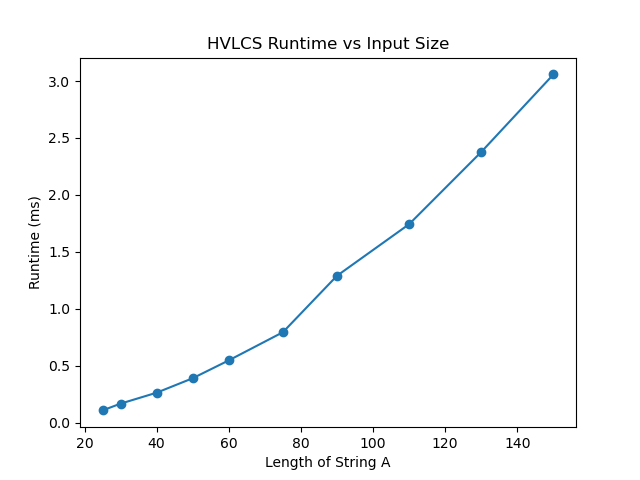

# Highest Value Longest Common Subsequence
## Generating Random Test Files
To generate sample example.in and example.out files run the command in terminal

python generator.py
or
python3 generator.py

This will populate the data/ folder with a new example.in and example.out to compare results with for main.py

## How To Run Program
To replicate the output in example.out, run the python file in terminal using the command

python src/main.py
or
python3 src/main.py

The file name "example.in" is already registered in the main function, so there's no neccessary additional arguments.

# Question Answers
## Q1


Note: Length of String A is equivalent to length of String B

## Q2
dp[i][j] will represent the maximum value of a common subsequence between the i characters of A and the j characters of B. 

The recurrence equation is provided below alongside base cases:

dp[i][j]= { 0 if i = 0, j = 0
            dp[i-1] + v(A[i]) if A[i] = B[j]
            max(dp[i-1][j], dp[i][j-1]) if A[i] != B[j]}

The recurrence considers two cases outside of the base cases. When the characters match, there is a chance to include the character in the subsequence only if it contributes to the maximum total value positively. The best value is whatever is optimal for A[1...i-1] and similarly with B to j-1th character + the value of the current character. If the value of A[i] is 0, then skip. When the characters don't match or the value is 0, we use the best value that comes from skipping the current character in A or B. This covers all possibilities and ll subproblems are solved before they are needed.


## Q3

```
Initialize dp[len(A+1 x len(B+1)] with 0

// this will populate the table
for i from 1 to len(A)
    for j from 1 to len(B)
        if A[i - 1] == B[j - 1]
            DP[i][j] = DP[i-1][j-1] + char_values[A[i-1]]
        else:
            DP[i][j] = max(DP[i-1][j], DP[i][j-1])

// this will reconstruct the subsequence
result = "" 
i = m, j = n
while i, j > 0
    if A[i] == B[j] and v[A[i]] > 0 and dp[i][j] == dp[i-1][j-1] + v[A[i]]:
            result = A[i] + result
            i = i - 1
            j = j - 1
        else if dp[i-1][j] >= dp[i][j-1]:
            i = i - 1
        else:
            j = j - 1


return dp[m][n], result
```

let n = the lenghts of A and m = the lengths of B
O(n x m) would be the overall runtime and space complexity of the code

